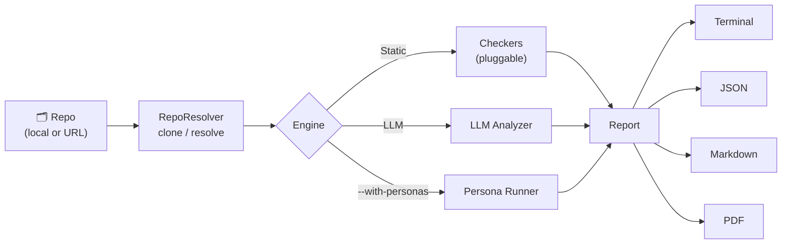
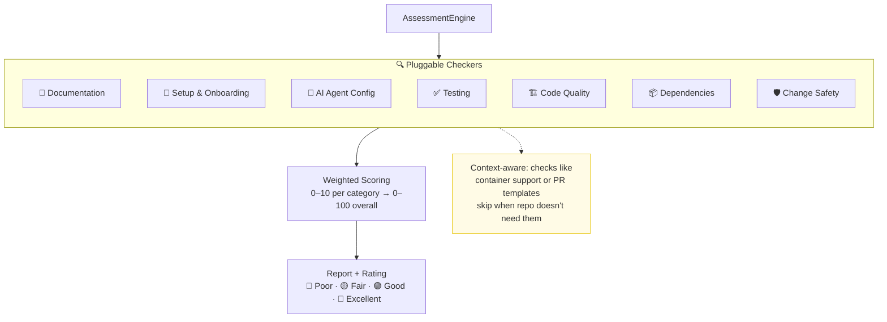
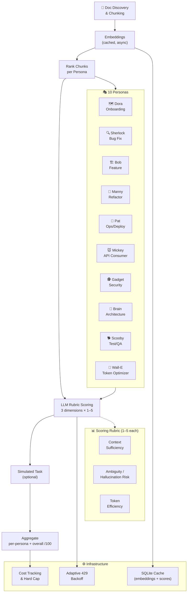
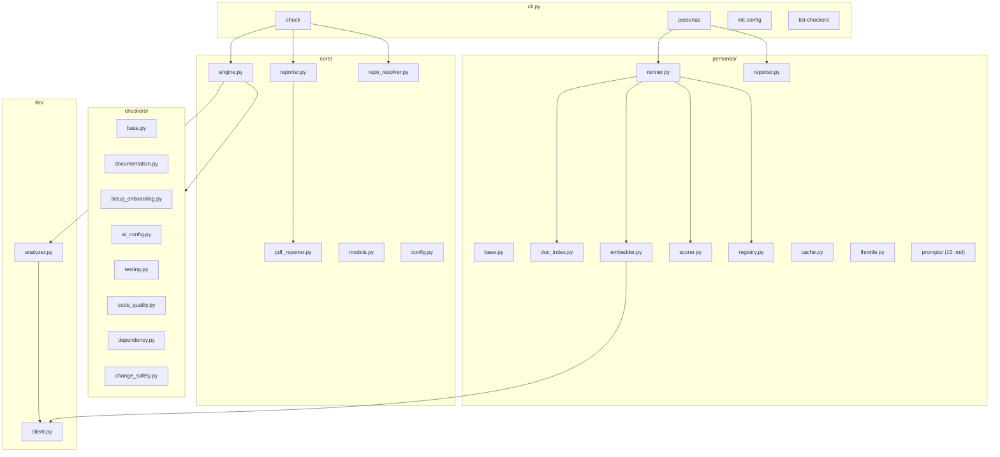

# 🤖 AI Readiness Tool

Assess how **AI coding agent friendly** your repository is. Get a score (0-100) with actionable recommendations — works with any language, any codebase, any AI agent.

The tool ships **two complementary engines**:

1. **`check`** — fast static + LLM-assisted analysis of repo hygiene (READMEs, configs, tests, ops, agent files…).
2. **`personas`** — sends every doc through 10 cartoon-coded AI-agent personas (Dora, Sherlock, Bob, Handy Manny, Postman Pat, Mickey, Inspector Gadget, Brain, Scooby, Wall-E) and rates whether the docs give them enough context to do their job without hallucinating.

Both can be run in one shot with `check --with-personas` and exported to **terminal, JSON, Markdown, or PDF**.

---

## Features

- **Language-agnostic** — detects your stack and adapts checks automatically
- **Agent-agnostic** — checks readiness for Copilot, Cursor, Aider, Claude, and more
- **Persona suite** — 10 role-based personas score docs on context sufficiency, ambiguity / hallucination risk, and token efficiency
- **Plugin architecture** — add custom dimensions via YAML config
- **Hybrid analysis** — static checks + optional LLM-powered deep analysis (OpenAI **or** Azure OpenAI auto-detected)
- **4 output formats** — Terminal (rich), JSON (CI), Markdown (PR comments), PDF (executive reports)
- **Read-only** — never modifies the target repo; safe to run on any clone
- **Cost-aware** — `--max-cost-usd` hard cap, dry-run estimates, embedding + score caching
- **Quota-friendly** — adaptive 429 backoff, configurable concurrency, `--max-embed` cap for tight Azure tiers
- **Run history** — every persona run is persisted under `~/.ai-readiness/cache/<repo-id>/runs/<timestamp>/`
- **Local & remote** — scan local paths or clone from GitHub URLs

---

## Quick Start

```bash
# Install
pip install -e .

# Optional: PDF output support
pip install -e .[pdf]

# Scan current directory
ai-readiness check .

# Scan a GitHub repo
ai-readiness check https://github.com/microsoft/vscode

# Scan with shorthand
ai-readiness check microsoft/vscode

# Run static checks AND the persona suite, export to PDF
ai-readiness check . --with-personas --format pdf --output report.pdf
```

---

## Commands

| Command | Purpose |
|---|---|
| `check <path-or-url>` | Run the static + LLM repo assessment. Add `--with-personas` to also run the persona suite. |
| `personas <path-or-url>` | Score docs through the 9 AI-agent personas (full controls). |
| `init-config` | Bootstrap `~/.ai-readiness/config.yaml`. |
| `list-checkers` | List the configured assessment dimensions. |

---

## `check` — Static + LLM Assessment

```bash
ai-readiness check . [--with-personas] [options]
```

### Common flags

```bash
--format terminal|json|markdown|pdf      # Output format
--output PATH                             # Required for --format pdf
--no-llm                                  # Disable LLM analysis (static only)
--config FILE                             # Custom config YAML
--agents copilot,cursor,claude,aider      # Score only specific agents
--with-personas                           # Also run the persona suite
--personas onboarding,architecture        # (with --with-personas) subset
--personas-max-cost-usd 1.50              # (with --with-personas) cost cap
--personas-max-embed 300                  # (with --with-personas) chunk cap
--personas-concurrency 2                  # (with --with-personas) parallelism
--chat-model gpt-4o                       # Override chat model / Azure deployment
--embedding-model text-embedding-3-large  # Override embedding model
--verbose                                 # Detailed output
```

### Assessment dimensions

| Dimension | Weight | What it checks |
|-----------|--------|----------------|
| 📄 Documentation | 20% | README, CONTRIBUTING, architecture docs, changelog |
| 🚀 Setup & Onboarding | 15% | Makefile, Dockerfile, scripts, env templates |
| 🤖 AI Agent Configuration | 15% | copilot-instructions, cursorrules, AGENTS.md, CLAUDE.md |
| ✅ Testing & Verification | 20% | Test files, CI/CD pipelines, coverage config |
| 🏗️ Code Quality & Structure | 15% | Linters, formatters, type checking, file sizes |
| 📦 Dependency Management | 8% | Lock files, manifests, version pinning |
| 🛡️ Change Safety | 7% | PR templates, pre-commit hooks, security policy |

### Scoring

- Each dimension scores **0-10** based on checks passed
- **Overall score** = weighted average (0-100)
- Ratings: 🔴 Poor (0-39) · 🟡 Fair (40-59) · 🟢 Good (60-79) · 🌟 Excellent (80-100)

---

## `personas` — Doc Readiness for AI Agents

The persona suite asks: *"If an AI coding agent only had your docs, could it actually do its job?"* Each persona scores docs on three rubric dimensions (1–5):

- **Context sufficiency** — does the doc give the agent what it needs?
- **Ambiguity / hallucination risk** — could the doc lead the agent astray?
- **Token efficiency** — is the signal-to-noise ratio worth the context window?

### How Persona Analysis Works

Each persona evaluates every documentation file against a **3-dimension rubric** (scored 1–5):

| Rubric Dimension | What It Answers |
|---|---|
| **Context Sufficiency** | Does this doc give the AI agent enough information to complete its task without guessing? |
| **Ambiguity / Hallucination Risk** | Could vague or contradictory content cause the AI to produce incorrect code? |
| **Token Efficiency** | Is the signal-to-noise ratio worth the context window space, or is the doc bloated with irrelevant content? |

**Example:** When the *"Dora the Explorer" (Onboarding)* persona scans a repo, it asks: *"If I were a brand-new AI agent dropped into this codebase, could I set up, build, and make my first contribution using only these docs?"* If the answer is no, it flags exactly what's missing — setup steps, environment variables, architecture overview, etc.

This gives you something static analysis alone cannot: a **role-specific quality signal**. A repo might score well on *having* a README, but persona analysis reveals that the README lacks the build instructions an AI agent actually needs. It bridges the gap between *"docs exist"* and *"docs are actually useful to AI agents."*

### The cast

| ID | Persona | Role |
|---|---|---|
| `onboarding` | Dora the Explorer | New contributor / first-time agent |
| `bug_fix` | Sherlock Hound | Debug & defect localisation |
| `feature_builder` | Bob the Builder | Adding a new feature |
| `refactor` | Handy Manny | Refactoring existing code safely |
| `ops_deploy` | Postman Pat | Build, run, deploy |
| `api_consumer` | Mickey Mouse | External API/SDK consumer |
| `security_review` | Inspector Gadget | Security review |
| `architecture` | Pinky & The Brain | Big-picture architectural understanding |
| `test_qa` | Scooby-Doo | Test/QA, coverage, fixtures |
| `token_optimizer` | Wall-E | Token efficiency & doc compactness |

### Common usage

```bash
# Run all 10 personas, markdown report
ai-readiness personas .

# Just one persona, hard cost cap, fewer chunks
ai-readiness personas . \
    --personas onboarding \
    --max-cost-usd 0.50 \
    --max-embed 100 \
    --format markdown

# Dry-run (estimate without LLM calls)
ai-readiness personas . --dry-run
```

### All `personas` flags

```bash
--personas onboarding,architecture        # Comma-separated subset
--format terminal|json|markdown
--top-k N                                 # Top-N most relevant docs per persona
--max-docs N                              # Hard cap on docs scored per persona
--max-embed N                             # Cap chunks embedded (Azure quota relief)
--sample N                                # Random sample from shortlist
--max-cost-usd 1.50                       # Abort once estimated spend exceeds this
--concurrency 5                           # Parallel LLM calls
--no-simulated-task                       # Skip the per-persona end-to-end task
--dry-run                                 # Estimate cost only
--no-cache                                # Disable caching for this run
--clear-cache                             # Wipe cache for this repo first
--cache-dir PATH                          # Override cache root
--cache-key KEY                           # Override repo cache key
--chat-model gpt-4o                       # Chat model / Azure deployment
--embedding-model text-embedding-3-large  # Embedding model / Azure deployment
--verbose
```

### What gets persisted

Every persona run writes to `~/.ai-readiness/cache/<repo-id>/runs/<UTC-timestamp>/`:

- `report.json` — full structured payload
- `report.md` — human-readable Markdown

Plus a rolling `runs/latest.json` pointer. Embeddings and per-chunk persona scores are also cached (SQLite) so re-runs cost only a fraction of the first run.

---

## LLM Configuration

The tool auto-detects **Azure OpenAI** when these env vars are set:

```powershell
$env:AZURE_OPENAI_API_KEY = "..."
$env:AZURE_OPENAI_ENDPOINT = "https://<resource>.openai.azure.com/"
$env:AZURE_OPENAI_API_VERSION = "2024-12-01-preview"
```

Otherwise it falls back to the **OpenAI** API key in `~/.ai-readiness/config.yaml`:

```bash
ai-readiness init-config --api-key sk-...
```

To run completely offline (static checks only):

```bash
ai-readiness check . --no-llm
```

---

## Output Formats

```bash
# Terminal (default) — rich colored output with score bars
ai-readiness check .

# JSON — machine-readable for CI pipelines
ai-readiness check . --format json > report.json

# Markdown — shareable, suitable for PR comments
ai-readiness check . --format markdown > report.md

# PDF — executive report (requires the [pdf] extra)
pip install -e .[pdf]
ai-readiness check . --with-personas --format pdf --output report.pdf
```

When `--with-personas` is set, the persona section (overall score + per-persona table) is appended to all four formats.

---

## CI Integration

Add to your GitHub Actions workflow:

```yaml
- name: AI Readiness Check
  run: |
    pip install ai-readiness
    ai-readiness check . --format json > report.json
```

Or use the included workflow at `.github/workflows/ai-readiness.yml` which auto-comments on PRs.

---

## Architecture

### High-Level Flow



### Static Assessment Pipeline



### Persona Doc-Readiness Pipeline



### Module Map



---

## License

MIT
